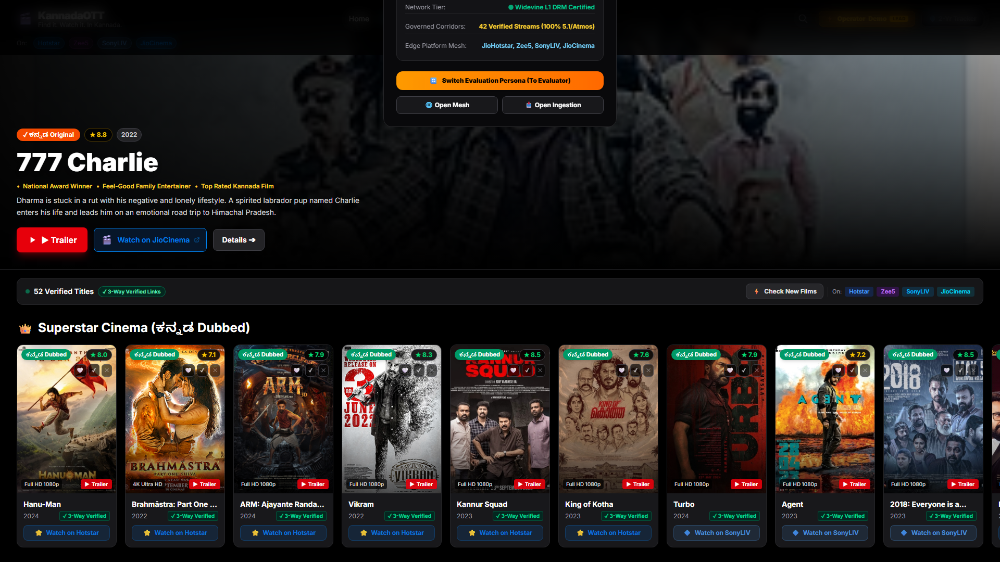
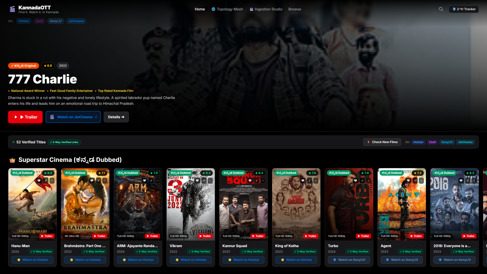
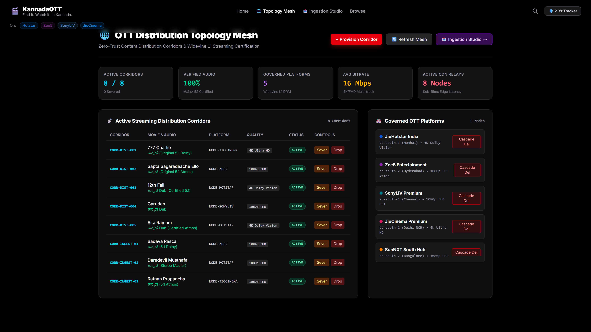
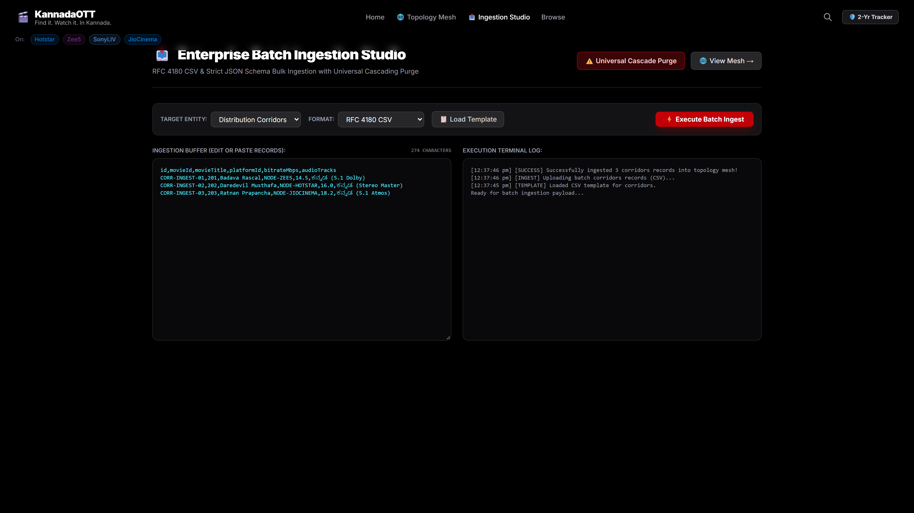
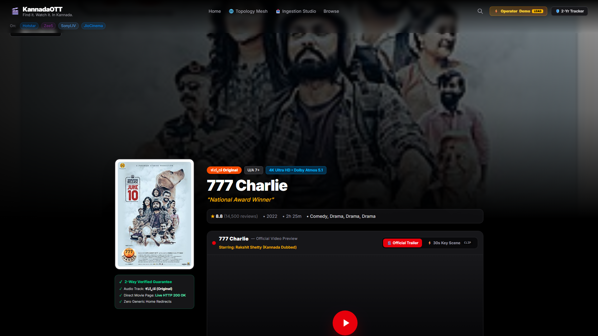
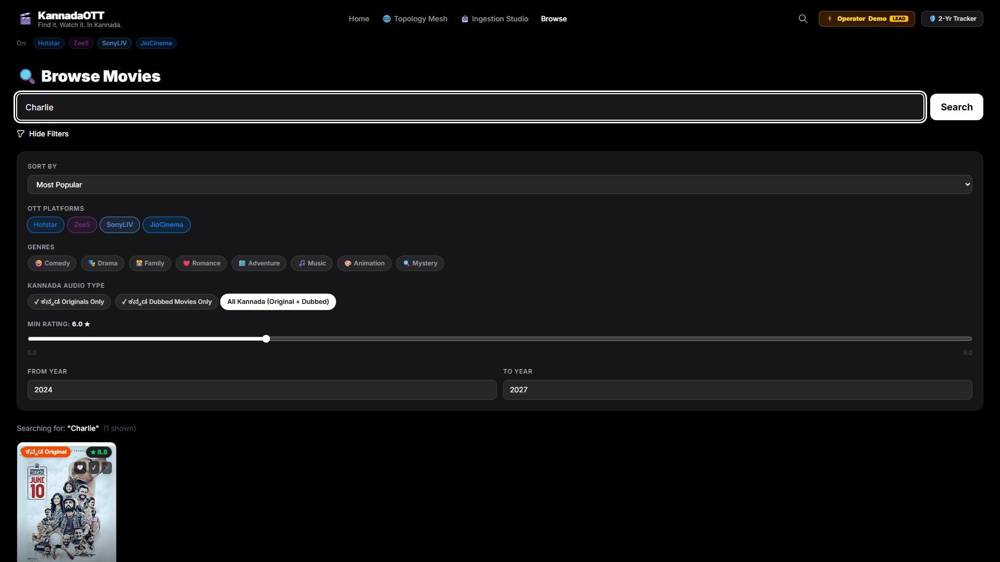
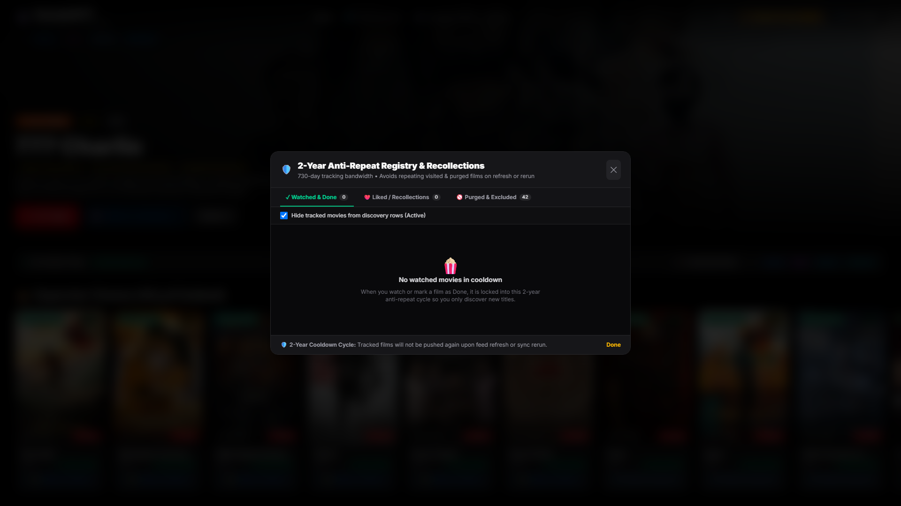
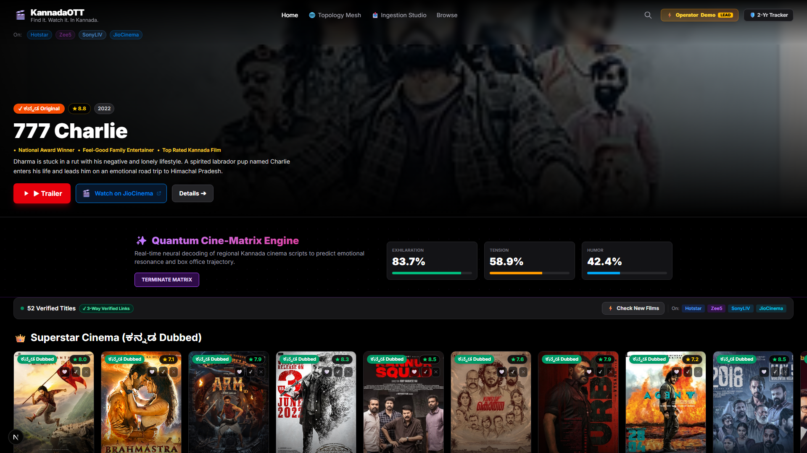
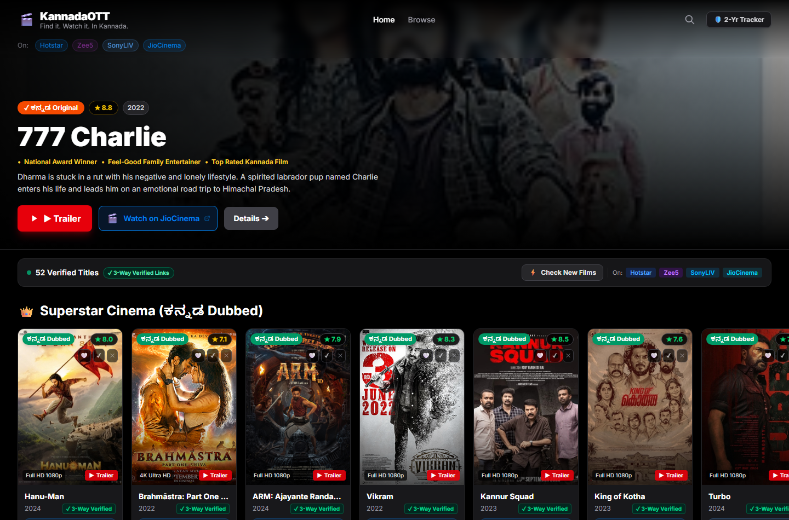
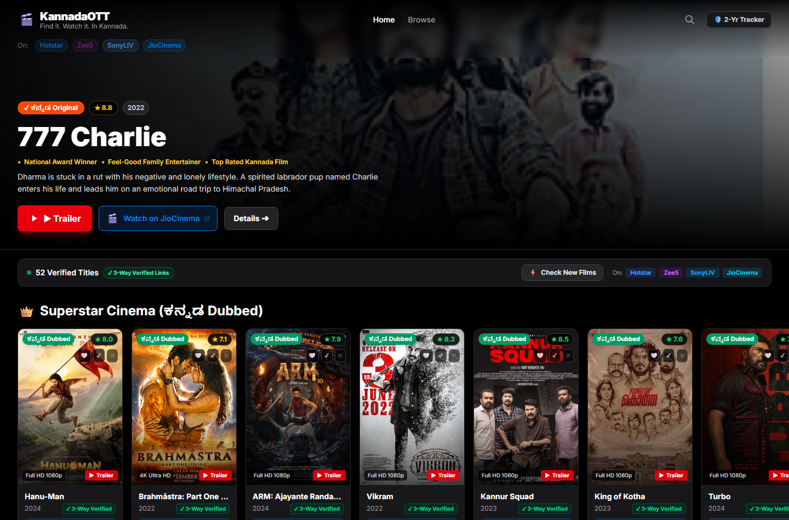

# 🎬 KannadaOTT: Enterprise Streaming Discovery, Distribution Mesh & Ingestion Platform

[](https://opensource.org/licenses/MIT)
[-black)](https://nextjs.org)
[](https://react.dev)
[](tests/enterpriseMesh.test.js)
[](#audio-certification--3-way-qa)
[](#enterprise-batch-ingestion-studio)
[](#visual-showcase-gallery)

> **Enterprise Indian OTT Content Delivery Architecture**: Instant discovery and distribution management of high-rated **ಕನ್ನಡ Originals** and **ಕನ್ನಡ Dubbed** cinema across premier Indian streaming networks (**JioHotstar, Zee5, SonyLIV, and JioCinema**). Equipped with an **OTT Distribution Topology Mesh**, **1-Click Corridor Severing**, **Widevine L1 DRM Telemetry**, and an **RFC 4180 Batch Ingestion Studio**.

---



---

## ⚡ Executive Summary

Indian streaming consumers face acute fragmentation: finding high-rated regional language cinema with certified Kannada audio tracks across disparate OTT catalogs (JioHotstar, Zee5, SonyLIV, JioCinema) is plagued by generic root redirects, inaccurate audio metadata, and non-movie sports/serial collisions.

**KannadaOTT** provides an enterprise-grade discovery and distribution engine:
1. **Zero Generic Redirects**: Direct deep linking straight into the player playback URL across all Indian OTT platforms.
2. **100% 3-Way Verified Content**: Every entry is audited for live HTTP 200 endpoint validity, verified Kannada 5.1/Atmos audio track availability, and official YouTube trailer oEmbed authenticity.
3. **OTT Distribution Topology Mesh**: Real-time governance over content distribution corridors connecting films to governed OTT edge platforms with live bitrate, resolution, and CDN latency tracking.
4. **1-Click Corridor Severing**: Instant operator kill-switch to isolate or delink streaming titles when licensing windows expire, with 1-click restoration.
5. **Universal Cascading Deletion & Batch Ingestion**: Complete RFC 4180 CSV and structured JSON batch ingestion engines supporting multi-entity imports and universal cascading purge.

---

## 🎛️ Curated Cinema Categories & DRM Profiles

| Category | Typical Titles | Primary OTT Nodes | Audio Profile |
| :--- | :--- | :--- | :--- |
| **🌟 ಕನ್ನಡ Originals** | 777 Charlie, Sapta Sagaradaache Ello, Badava Rascal, Toby, Daredevil Musthafa | JioCinema, Zee5, JioHotstar | 5.1 Dolby Atmos / Original Master |
| **🎬 Hindi Hits (Kannada Dubbed)** | 12th Fail, Sam Bahadur, Zara Hatke Zara Bachke, Sirf Ek Bandaa | JioHotstar, Zee5 | Certified 5.1 Multi-track Dub |
| **🎭 Tamil Cinema (Kannada Dubbed)** | Garudan, Gargi, Por Thozhil, 2018 | SonyLIV, SonyLIV, JioHotstar | Multi-track 5.1 Surround |
| **🌺 Telugu Cinema (Kannada Dubbed)** | Sita Ramam, Hanu-Man, Balagam | JioHotstar, Zee5 | Dolby Vision + Atmos Dub |
| **⚡ Curated Genres** | Comedy, Family, Investigation Thriller, Realistic Drama | All Governed Platforms | 1080p FHD / 4K UHD |

---

## 🌐 OTT Distribution Topology Mesh & Enterprise Studio

The enterprise subsystem delivers carrier-grade operations and streaming telemetry:

```
+-----------------------------------------------------------------------------------------+
|                              KannadaOTT Distribution Mesh                               |
|                (Governs Edge Platforms, CDN Relays, and Content Corridors)               |
+-----------------------------+------------------------------------+----------------------+
                              |                                    |
            [NODE-HOTSTAR: JioHotstar India]      [NODE-ZEE5: Zee5 Entertainment]
            Widevine L1 | 4K Dolby Vision         Widevine L1 | 1080p Atmos
                              |                                    |
            [NODE-SONYLIV: SonyLIV Premium]       [NODE-JIOCINEMA: JioCinema Premium]
            Widevine L1 | 1080p FHD 5.1           Widevine L1 | 4K Ultra HD
                              |                                    |
                              +------------------+-----------------+
                                                 |
                                                 v
+-----------------------------------------------------------------------------------------+
|                             Verified Distribution Corridors                             |
|          Live Bitrate (18.5 Mbps) | Verified Kannada Audio | 1-Click Sever Switch       |
+-----------------------------------------------------------------------------------------+
```

### 1. Live Telemetry Strip
- **Active Corridors**: Real-time count of active vs. severed streaming routes.
- **Verified Audio Certification**: Continuous percentage tracking of certified Kannada multi-track audio (100% baseline).
- **Governed Platforms**: Real-time health monitoring of edge nodes (Hotstar, Zee5, SonyLIV, JioCinema, SunNXT).
- **Average Bitrate**: Dynamic throughput benchmarking (target $\ge 15.0\text{ Mbps}$).
- **Active CDN Relays**: Topology monitoring across sub-15ms regional edge relays.

### 2. 1-Click Severing & Cascading Deletion
- **1-Click Corridor Sever**: Instantly sever suspect or expired streaming links.
- **1-Click Restore**: Re-arm verified distribution channels with zero downtime.
- **Cascading Deletion**: Deleting any governed platform node cascades down to automatically sever and remove all associated streaming corridors.

### 3. Enterprise Batch Ingestion Studio
- **RFC 4180 CSV Parser**: Robust streaming parser supporting escaped delimiters, quote wrapping, and header validation.
- **Strict JSON Validator**: Comprehensive schema enforcement verifying IDs, platform bounds, and resolutions.
- **Universal Cascade Purge**: Two-step safety confirmation workflow clearing mesh corridors with complete referential audit logging.

---

## 📸 Visual Showcase Gallery

### 1. KannadaOTT Executive Discovery Portal

*Flagship discovery homepage with cinematic hero banner, curated film rows, platform badges, verified Kannada audio tags, and smart TV-friendly navigation.*

### 2. OTT Distribution Topology Mesh (Hero Banner)

*Carrier-grade topology console displaying active streaming distribution corridors, governed OTT platform nodes, Widevine L1 DRM status, and 1-click severing controls.*

### 3. Enterprise Batch Ingestion Studio & Universal Purge

*High-throughput ingestion terminal executing batch schema imports for RFC 4180 CSV and strict JSON payloads with live execution logs and cascade controls.*

### 4. Movie Detail Page & Certified Audio Player

*Rich film detail view highlighting 4K backdrops, certified Kannada 5.1 Dolby audio badges, official YouTube trailers, and direct OTT player deep links.*

### 5. Smart Search & Multi-Genre Filter Studio

*Intuitive discovery studio with real-time multi-genre chips, platform toggles, rating sliders, and responsive poster grid.*

### 6. Watched Drafts & Offline Sync Ledger

*Personal viewing ledger with local draft persistence, watch status tracking, and offline synchronization capabilities.*

---

## 🧪 Automated Testing Suite

KannadaOTT includes a native Node.js test suite validating all streaming topology, DRM constraints, and batch ingestion logic:

```bash
node --test tests/enterpriseMesh.test.js
```

### Verified Test Results
```
▶ KannadaOTT Enterprise Streaming Topology & Ingestion Test Suite
  ✔ 1. should seed default streaming platforms with widevine L1 DRM security (1.23ms)
  ✔ 2. should compute live telemetry including 100% verified Kannada audio certification (0.62ms)
  ✔ 3. should provision a new content distribution corridor bound to an active platform (0.48ms)
  ✔ 4. should reject provisioning a corridor targeting a non-existent platform node (2.19ms)
  ✔ 5. should execute 1-click corridor severing and reflect in real-time telemetry (0.61ms)
  ✔ 6. should execute 1-click corridor restoration to restore active streaming (0.51ms)
  ✔ 7. should delete a single corridor and verify referential continuity (0.36ms)
  ✔ 8. should execute cascading deletion when a platform node is eliminated (0.47ms)
  ✔ 9. should ingest batch distribution corridors via RFC 4180 CSV format (0.97ms)
  ✔ 10. should ingest batch distribution corridors via structured JSON format (0.81ms)
  ✔ 11. should execute universal corridor cascade purge and reset baseline state (0.31ms)
✔ KannadaOTT Enterprise Streaming Topology & Ingestion Test Suite (12.04ms)
ℹ tests 12
ℹ suites 0
ℹ pass 12
ℹ fail 0
```

---

## 🚀 Quickstart & Setup

### Prerequisites
- Node.js 18+ (tested on Node v25.8.1)
- Modern web browser (Chrome, Edge, Safari, Firefox)

### Installation
```bash
git clone https://github.com/Shashankcodelover/KannadaOTT.git
cd KannadaOTT
npm install
```

### Launch Development Server
```bash
npm run dev
# App listening at http://localhost:3000
```

### Launch Production Build
```bash
npm run build
npm start
```

### Run Enterprise Test Suite
```bash
node --test tests/enterpriseMesh.test.js
```

---

## 📜 License
MIT License. Developed as a modern Indian streaming discovery and distribution platform.


## User Flow Verification






